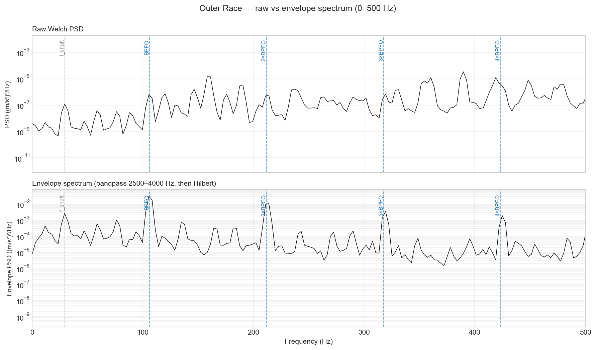
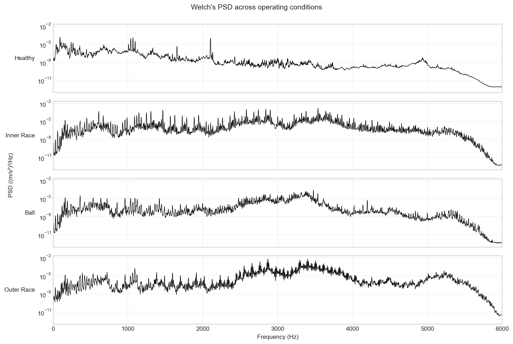
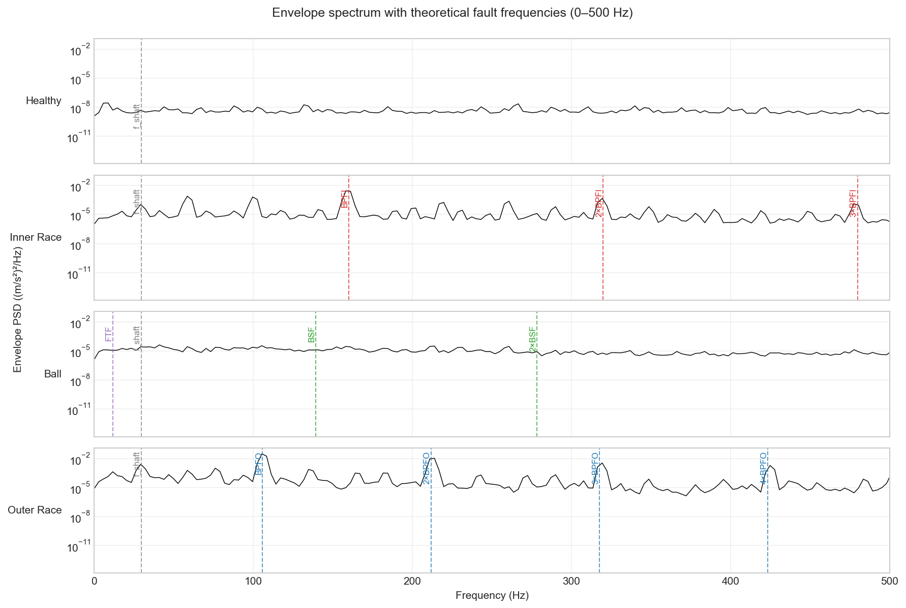
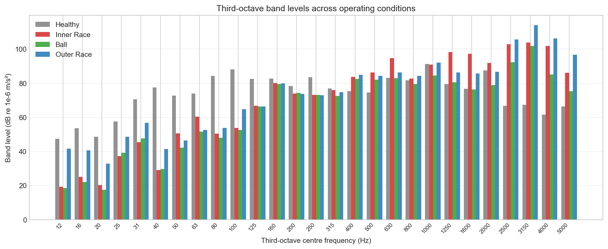

# Vibration Analysis Toolkit

A Python toolkit for vibration signal processing, applied to the Case Western
Reserve University bearing dataset as a worked example. The signal processing
and reporting modules are domain-agnostic and apply to any vibration
measurement; the bearing analysis demonstrates the toolkit in use on a
canonical benchmark dataset.



*The diagnostic case for envelope analysis. The raw Welch PSD (top) shows
the theoretical bearing fault frequencies present but indistinguishable from
surrounding non-fault peaks. After bandpass filtering around the housing
resonance and Hilbert envelope demodulation (bottom), the fault frequencies
appear as the dominant features of the spectrum.*

## Overview

The project covers four analysis stages: time-domain statistical
characterisation, Welch power spectral density estimation, Hilbert envelope
analysis, and third-octave band reporting per IEC 61260. Each stage is
implemented as a function (or small group of functions) in the `src/` package
and demonstrated end-to-end on the CWRU dataset in a single clean notebook.

The split between the toolkit and the example matters. The signal processing
techniques used here are the same ones used across vibration analysis work,
whether the source is a bearing, a railway tunnel, a building near a
construction site, or a wind turbine drivetrain. By keeping the bearing
geometry and dataset loader in their own module, the rest of the code can be
imported and applied to a different measurement without modification.

## Background

Rolling element bearings produce broadband random vibration when healthy and
a sequence of sharp impulses when faulty. Each impulse occurs when a damaged
surface (on a race or on a rolling element) passes through the load zone, and
the rate of these impulses is set by the bearing geometry and the shaft
speed. This is the basis of bearing fault diagnostics: if you can identify
the impulse rate in the vibration signal, you know which component is
damaged.

The difficulty is that the impulses do not appear cleanly at the fault
frequency in the raw vibration spectrum. Each impulse excites the structural
resonance of the bearing housing, which rings at its own natural frequency
of several kilohertz ([Randall and Antoni 2011](https://www.sciencedirect.com/science/article/abs/pii/S0888327010002530)).
The dominant spectral content sits at this resonance rather than at the
fault frequency. The fault frequency information is encoded in the amplitude
modulation of the resonance, not in its centre.

Envelope analysis recovers the modulation. The signal is bandpass-filtered
around the housing resonance to isolate the impact-excited content, then
Hilbert-transformed to extract the amplitude envelope, then spectrum-analysed
to reveal the modulation rate. The result is a clean diagnostic spectrum in
which the fault frequencies appear as dominant peaks.

The same techniques (Welch's PSD, bandpass filtering, envelope demodulation,
third-octave band reporting) form the standard toolkit for vibration analysis
across applications: machinery condition monitoring, ground-borne vibration
from rail and road traffic ([ISO 14837-1:2005](https://www.iso.org/standard/31447.html)),
structure-borne vibration in buildings, and human exposure assessment under
standards such as AS 2670 and ISO 2631.

## Methodology

The analysis pipeline has four stages, each implemented as a module in
`src/signal_processing` or `src/reporting`.

**Time-domain characterisation.** Each acceleration record is summarised by
standard scalar indicators: RMS for overall vibration energy, peak and crest
factor for impulsive content, and classical kurtosis (Gaussian baseline of 3)
for the impulsiveness of the amplitude distribution. These are the indicators
a condition monitoring system would trend over time, and they provide a
first-pass diagnostic before any frequency analysis. The healthy CWRU signal
returns a kurtosis of 2.93, which is essentially Gaussian and confirms the
baseline is well-behaved. The race fault conditions show clearly elevated
kurtosis; the ball fault does not, which is the first indication that ball
faults are diagnostically harder to detect.

**Frequency-domain analysis.** Power spectral densities are estimated using
Welch's method with 4096-sample segments, 50% overlap, and a Hann window.
The choice of segment length is a trade-off between frequency resolution
(2.93 Hz at 12 kHz sampling) and the number of segments averaged (about 60
for the 10-second fault records). The resolution is fine enough to separate
the bearing fault frequencies from each other and from shaft harmonics, and
the averaging is sufficient for a statistically stable spectrum. The bearing
fault frequencies appear at the predicted locations in the resulting PSDs
but sit among non-fault peaks of comparable magnitude, which motivates the
move to envelope analysis.

**Envelope analysis.** The signal is bandpass-filtered with a fourth-order
Butterworth filter applied forward and backward (via second-order sections)
to preserve impulse timing. The passband is 2500–4000 Hz, chosen from
visual inspection of the Welch PSDs to capture the housing resonance band
where the impact-excited content concentrates. The filtered signal is then
demodulated via the Hilbert transform, which constructs an analytic signal
whose magnitude is the instantaneous amplitude envelope. The envelope's
mean is subtracted before computing its PSD (otherwise the DC component
dominates the spectrum). The resulting envelope spectrum contains the
modulation pattern at the fault frequency, with the housing resonance
removed.

**Third-octave band reporting.** The Welch PSDs are converted into band
levels at the standard third-octave centre frequencies from 12.5 Hz to
12.5 kHz per IEC 61260, with each band's level computed by integrating
the PSD across edges at ±1/6 octave from the centre. Levels are expressed
in dB relative to 10⁻⁶ m/s² per [ISO 1683](https://www.iso.org/standard/52054.html).
This is the standardised reporting framework used for compliance assessment
against vibration standards, and it answers a different question from the
envelope spectrum: not "what fault is present" but "how much vibration
energy is present in standardised bands." Both views appear in the final
diagnostic notebook.

## Results

The diagnostic results from the four-condition bearing analysis confirm the
methodology's behaviour as expected by the literature. Race fault frequencies
are detected with high confidence (BPFI and BPFO peaks at 17–26 dB SNR
across multiple harmonics), ball fault frequencies are detected only
marginally (BSF at 4–7 dB SNR), and the healthy baseline shows no spectral
peaks at any of the predicted fault frequencies. The full diagnostic table
with measured frequencies, deviations from theoretical, and detection flags
is in the [final notebook](notebooks/04_bearing_diagnostics.ipynb).

### Time-domain indicators

The four conditions are clearly distinguished by their time-domain
statistics. Healthy RMS sits at 0.066 m/s², outer race at 0.592 m/s² (a
factor of nine elevation), inner race at 0.293, and ball at 0.139. Kurtosis
identifies the race faults clearly (5.5 and 7.6 against the Gaussian
baseline of 2.9) but returns essentially Gaussian (3.0) for the ball fault,
which is the first quantitative indication that ball faults are not
detectable from time-domain indicators alone.

### Welch power spectral density



The full-range Welch PSDs show the dominant fault content concentrated in
the 2500–4000 Hz housing resonance band, not at the bearing fault
frequencies. This is the structural-resonance-excited-by-impacts mechanism
in action: the impacts ring the housing, and most of the spectral energy
sits at the resonance rather than at the fault frequency. The faulted
conditions also show a broadband elevation of the noise floor relative to
healthy, particularly in the low-frequency region below 1000 Hz.

When the spectra are replotted at the 0–500 Hz range with the theoretical
fault frequencies overlaid, the peaks appear at the predicted locations,
but they sit among non-fault peaks of comparable magnitude. The
diagnostic is present but not visually distinguished, which is the
motivation for envelope analysis.

### Envelope spectrum



The envelope spectrum transforms the ambiguous raw spectrum into a clean
diagnostic for race faults. The outer race condition shows four well-spaced
BPFO harmonics at 22–26 dB SNR with no significant sideband modulation,
consistent with a stationary fault in the load zone. The inner race
condition shows BPFI and harmonics with visible shaft-frequency sidebands,
the spectral signature of load-zone modulation as the inner race rotates
through the load zone. The ball condition shows only marginal peaks at BSF
and 2×BSF, confirming the known difficulty of ball fault diagnosis.

### Third-octave band reporting



Band-level analysis presents the same data in the standardised reporting
form used by vibration consultancies. The faulted conditions show 15–30
dB elevation in the 2500–4000 Hz bands relative to the healthy baseline,
quantifying the fault content in terms compatible with compliance
assessment against standards such as ISO 10816. The low-frequency bands
also show notable variation across conditions, partly attributable to the
healthy recording being four times longer than the fault recordings.

### Toolkit performance summary

The bearing example confirms the toolkit handles the canonical cases
correctly and reveals its expected limits. Race faults are detected
unambiguously, with measured frequencies within 1% of theoretical for the
fundamental and most harmonics. Ball faults sit at the edge of envelope
analysis sensitivity, consistent with the literature on this class of
fault. The same pipeline applied to a different vibration measurement
(rail tunnel monitoring, building vibration assessment, footfall analysis)
would produce equivalent processing outputs, with the diagnostic
interpretation specific to that application.

## Project structure

```text
vibration-analysis/
    src/
        signal_processing/       Domain-agnostic signal processing
            spectral.py          Welch PSD, FFT
            filters.py           Butterworth bandpass
            envelope.py          Hilbert envelope, envelope spectrum
            statistics.py        RMS, kurtosis, peak detection
        reporting/               Standards-aware reporting utilities
            octave_bands.py      IEC 61260 third-octave conversion
            plotting.py          Standardised plot helpers
        bearings/                Example application (CWRU-specific)
            geometry.py          Bearing geometry, fault frequencies
            cwru.py              Dataset loading
    notebooks/
        01_data_exploration.ipynb     Time-domain inspection
        02_frequency_domain.ipynb     Raw Welch PSD analysis
        03_envelope_analysis.ipynb    Envelope analysis development
        04_bearing_diagnostics.ipynb  Clean end-to-end pipeline
    figures/                     Generated figures (referenced in README)
    data/                        CWRU .mat files (download separately)
        README.md                Instructions for obtaining the dataset
    requirements.txt
    LICENSE                      MIT
    README.md
```

The split between `signal_processing`, `reporting`, and `bearings` is the
architectural backbone of the project. The first two are domain-agnostic
and apply to any vibration measurement. The third contains the bearing
geometry and dataset loader, which would be replaced when applying the
toolkit to a different measurement. The dependency direction is
deterministic: `bearings` imports from `signal_processing` and `reporting`,
never the reverse.

The four notebooks fall into two groups. Notebooks 01–03 are the
exploratory record, retained as the working development log for the
analysis. They contain parameter sensitivity studies, intermediate
diagnostic checks, and step-by-step explanations of each technique.
Notebook 04 is the deliverable, importing from `src/` and reproducing the
full pipeline end-to-end in a polished form. The exploratory notebooks
are the working; the clean notebook is the result.


## References

This is the diagnostic basis of rolling element bearing fault detection
([Randall and Antoni 2011](https://www.sciencedirect.com/science/article/abs/pii/S0888327010002530)).